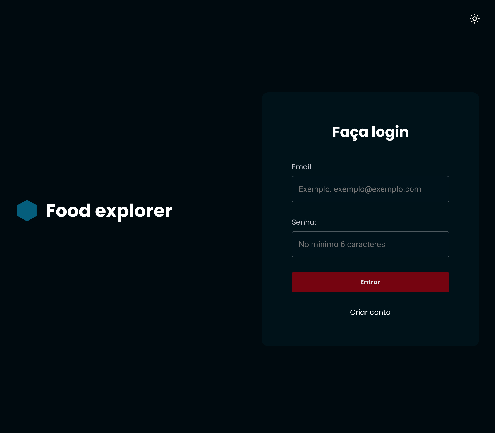

# 🥗 [Food Explorer](https://food-explorer-front-flame.vercel.app/)




## Table of Contents

  - [Description](#description)

  - [Built with](#built-with)

  - [How to run?](#how-to-run)
    
  - [Author](#author)


### Description

- Browse and choose a dish to satisfy your hunger.

### Built with

- HTML
- React
- Styled Components

### How to Run

1. Install all packages<br>
```
>> npm install
```

2. Now, run the following command:<br>
```
>> npm run dev
```

### Author

- Design: [Rocketseat](https://www.rocketseat.com.br/)

- Code: [Caio Rocha](https://github.com/caiowrocha)
